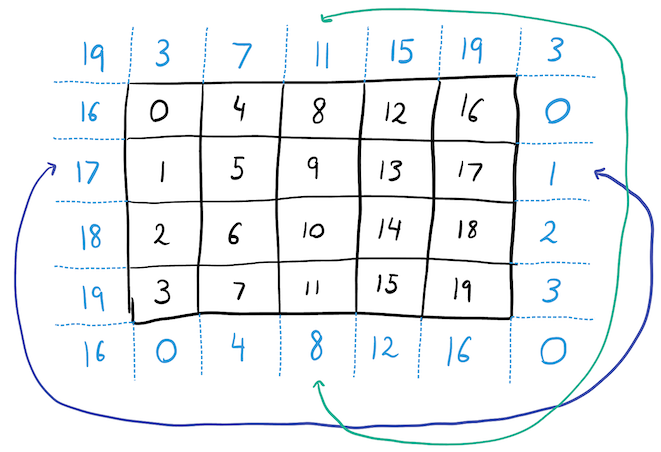

# COMP1110 Week 7 Lab

Before you start, you may wish to take a minute to watch the [intro video](https://cs.anu.edu.au/courses/comp1110/labs/mp4/lab7-intro.mp4) that runs through the goals of this lab.

This lab contains material from module [**O5**](https://cs.anu.edu.au/courses/comp1110/lectures/theme/#O5) (Abstract Classes), [**J14**](https://cs.anu.edu.au/courses/comp1110/lectures/theme/#J14) (Collections), and [**X1**](https://cs.anu.edu.au/courses/comp1110/lectures/theme/#X1) (JavaFX).

**Tasks**
1. [Rabbits and Foxes](#1-rabbits-and-foxes)

**Additional Exercises** 
1. [Cellular Automata](#1-cellular-automata)
2. [Ecosystem Modelling](#2-further-reading-ecosystem-modelling)
3. [Group Assignment](#3-work-on-your-group-assignment)

## Before the Lab

* Complete Week 7 of your personal journal, commit and push at least 5 minutes before your lab.

## Purpose

In this lab, you will complete an object-oriented implementation of a simple agent-based simulation.

**Your tutor will mark your engagement during the lab.**

## Part I: Check-In

Check in with **your tutor** together with the other members of your group.    Briefly outline any issues you're having that you'd particularly like help with during the lab (make sure you have your journal open and refer to it when you meet with your tutor).

## Part II:  Your Lab Tasks

### 1. Rabbits and Foxes

In this task, you will implement an agent-based simulation of a simple ecosystem containing three different kinds of organisms: grass, rabbits, and foxes.
Agents move over a grid of discrete locations, each containing some grass and at most one animal.
Each of these organisms behaves according to a simple set of rules.  
在本任务中，您将实现一个基于代理的简单生态系统模拟，其中包含三种不同的生物:草、兔子和狐狸。
代理在一个由离散地点组成的网格上移动，每个地点都包含一些草和最多一只动物。
每一种生物的行为都遵循一套简单的规则。

*Grass* grows at every location where an animal is not present.  
草生长在每一个没有动物的地方。

*Rabbits* move randomly to empty locations and eat grass.  
兔子随机移动到空的地方吃草。

*Foxes* move randomly, preferentially moving to neighbouring locations where there are rabbits and eating them.  
狐狸随机移动，优先移动到附近有兔子的地方并吃掉它们。

Animals (both rabbits and foxes) reproduce whenever they are not hungry.  
动物(兔子和狐狸)只要不饿就会繁殖。

The locations in the world are laid out on a Cartesian grid.
Each location has an x and a y coordinate, and eight neighbouring locations, which are those locations with x and y coordinates that differ by no more than 1.
The world has [periodic boundary conditions](https://en.wikipedia.org/wiki/Periodic_boundary_conditions), which means that if an animal moves off the right-hand edge of the grid (`x == world.sizeX`), it reappears on the left-hand edge (`x == 0`) and vice-versa, and if an animal moves off the bottom edge of the grid (`y == world.sizeY`), it reappears on the top edge (`y == 0`) and vice-versa.
The boundary conditions are shown for an example 5x4 grid in the diagram below; for example, location 15 has neighbouring locations {14,10,11,19,16,4,0,1}.  
世界上的位置都在笛卡尔网格上。每个位置都有一个x和一个y坐标，以及八个相邻的位置，这些位置的x和y坐标的差异不超过1。
世界有周期性的边界条件，这意味着如果动物离开网格的右边缘(x ==世界。sizeX)，它会重新出现在左侧边缘(x == 0)，反之亦然，如果动物离开网格的底部边缘(y == world。sizeY)，
它重新出现在上边缘(y == O)，反之亦然。边界条件如下图所示为一个5x4网格示例;
例如，位置15有相邻的位置(14、10、11、19、16、4、0、1)。

  

The class [World.java](World.java) contains an incomplete implementation of the simulation; Javadoc in this class defines the rules for each type of organism.
You should complete the methods marked "FIXME" after you have finished reading the rest of the explanation below. 
You should first complete the `getCurrentState` method, which will allow the GUI to interact with your World. 
After completing this method you should be able to launch the GUI, but you will need to complete the other FIXME methods before the rabbits and foxes will move around the world.   
类 [World.java](World.java) 包含模拟的不完全实现;这个类中的Javadoc为每种生物类型定义了规则。
在阅读完下面其余的解释之后，您应该完成标有“FIXME”的方法。
你应该首先完成“getCurrentState”方法，它将允许GUI与你的World交互。
在完成这个方法之后，您应该能够启动GUI，但在兔子和狐狸四处移动之前，您需要完成其他FIXME方法。

Note: you should read all the provided code before making changes.
Many of the rules are already implemented, including the rules for reproduction and starvation (in the methods `Animal.reproduce()` and `World.update()` respectively).  
注意:在进行更改之前，您应该阅读所有提供的代码。许多规则已经实施，包括繁殖和饥饿的规则(在方法动物。C)和“世界”。update()分别)。

We have provided a [complete GUI](WorldGUI.java) to visualize the simulation results.
Unfortunately, this GUI requires the world to be represented via a simple String interface.
You must complete the `World.getCurrentState()` method to convert from the internal (object-oriented) structure into the String representation that the GUI requires; the Javadoc for this method contains a full description of the String interface.
We have also provided a set of unit tests for each of the methods you need to complete, which you can run by selecting  the `L7 WorldTest` configuration from the **Run Configuration** menu and clicking  **Run**.  
我们提供了一个完整的GUI来可视化模拟结果。 不幸的是，这个GUI需要通过一个简单的String接口来表示世界。
你必须完成。getcurrentstate()方法将内部(面向对象)结构转换为GUI所需的String表示形式;该方法的Javadoc包含了String接口的完整描述。
我们还为您需要完成的每个方法提供了一组单元测试，您可以通过从run configuration菜单中选择L7 WorldTest配置并单击来运行它运行。

## Part III: Additional Exercises 

Remember that these are additional exercises for your own practice. They are not compulsory, but your tutor will be happy to provide assistance and feedback during the lab.

### 1. Cellular Automata

This simulation may remind you of [Conway's Game of Life](https://en.wikipedia.org/wiki/Conway%27s_Game_of_Life), which is a [cellular automaton](https://en.wikipedia.org/wiki/Cellular_automaton) with very simple rules which give rise to complex 'lifelike' behaviours.
While our simulation rules are described in terms of agents, it is possible to define an equivalent cellular automaton.
Can you create an alternative `World` implementation as a cellular automaton and connect it to the `WorldGUI` for visualization?
Which representation do you find more pleasing, and why?

### 2. Further Reading: Ecosystem Modelling

Our simulation is a simple example of an [agent-based ecosystem model](https://en.wikipedia.org/wiki/Agent-based_model_in_biology) containing predator and prey species.
This agent-based model is a variation of [Lotka-Volterra predator-prey interactions](https://www.cs.unm.edu/~forrest/classes/cs365/lectures/Lotka-Volterra.pdf); the use of agents allows for discrete populations and non-uniform mixing of predators and prey.

Try playing around with the values of certain parameters in the system, for example, `MAX_GRASS`, `MAX_HUNGER`, or the changes in hunger in rabbits and foxes due to consuming or not consuming other organisms.
You may find that small changes in the simulation rules lead to large and surprising changes in behaviour.

### 3. Work on your group assignment

Use any spare time to work on your group assignment.
